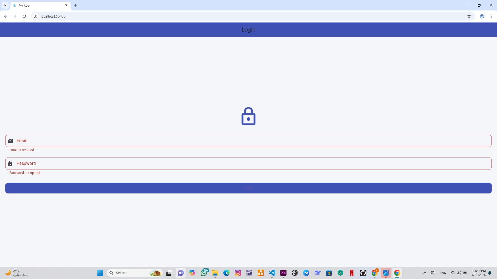
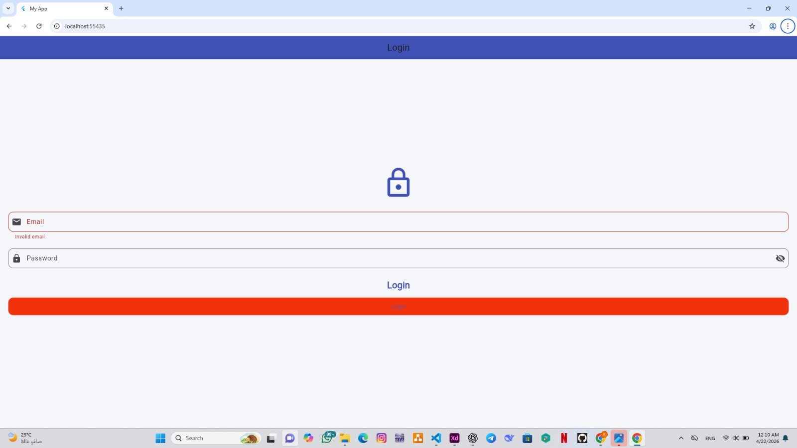
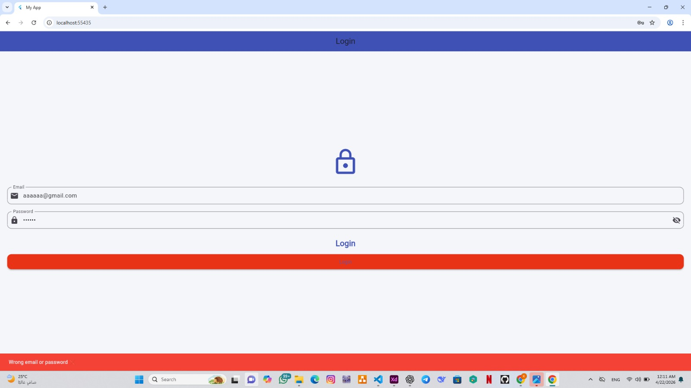
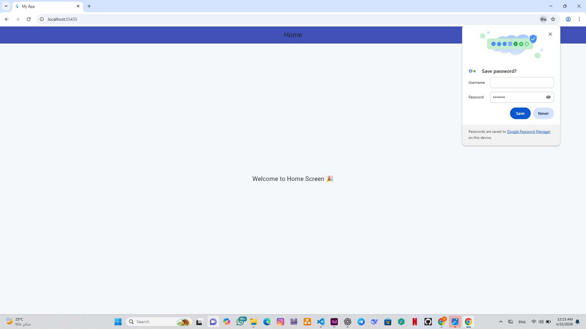

# 🔐 Flutter Login App

تطبيق تسجيل دخول بسيط باستخدام Flutter يوضح التحقق من صحة المدخلات (Validation) والتنقل بين الشاشات.

---

## ✨ Features

- التحقق من الحقول الفارغة
- التحقق من صحة الإيميل
- عرض رسالة خطأ عند بيانات خاطئة
- الانتقال إلى صفحة Home عند تسجيل الدخول الصحيح

---

## 📸 Screenshots

### 🧪 Empty Fields Validation

### ❌ Invalid Email

### 🚫 Wrong Credentials

### ✅ Successful Login (Home Screen)

---

## 🛠️ Technologies Used

* Flutter
* Dart

## ▶️ How to Run

flutter pub get
flutter run

## 📌 Notes

هذا المشروع تعليمي لتوضيح أساسيات:

* Form Validation
